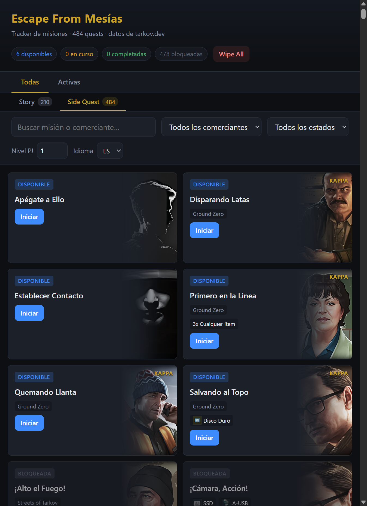
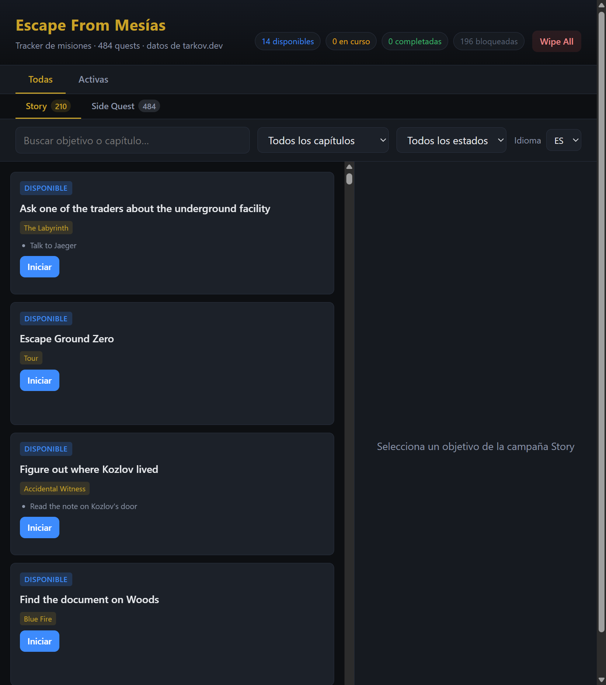
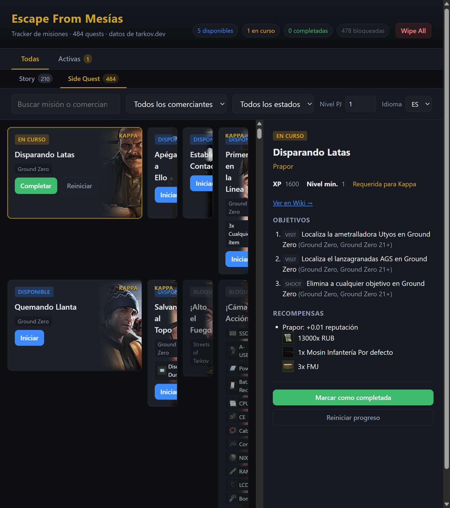
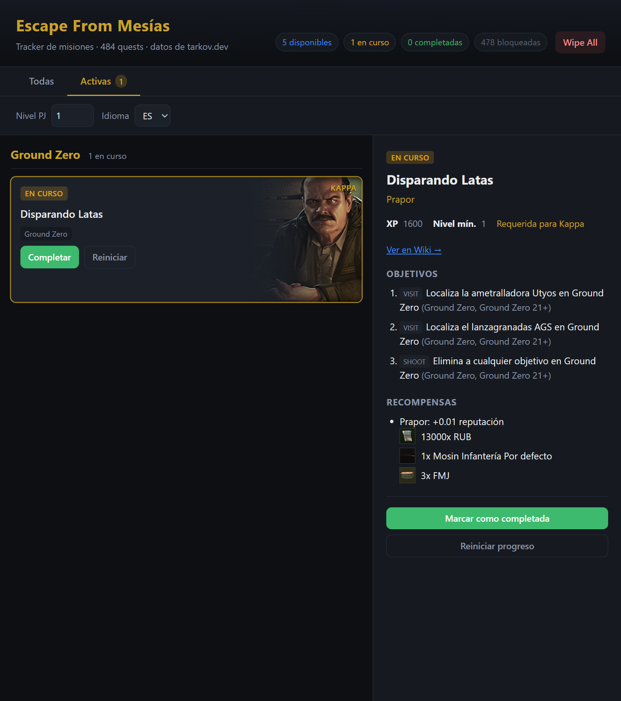

# Escape From Mesías

[](https://escape-from-mesias.vercel.app)
[](https://vite.dev)
[](https://react.dev)
[](https://www.typescriptlang.org/)

A web quest tracker for **Escape From Tarkov**. Browse trader side quests and the main Story campaign, track your progress locally, and see which missions are available based on prerequisites.

**Live demo:** [escape-from-mesias.vercel.app](https://escape-from-mesias.vercel.app)

## Screenshots

### Side Quests
Quest grid with trader art, status badges, map tags, and required items.



### Story campaign
Nine narrative chapters from TarkovBuddy with chapter filters and objective nodes.



### Quest detail
Objectives, rewards, wiki link, and progress actions for the selected quest.



### Active quests
In-progress quests grouped by map.



## What it does

- **Side Quests** — Loads trader quests from the public [tarkov.dev](https://tarkov.dev) GraphQL API (~500+ quests with objectives, keys, prerequisites, rewards, and wiki links).
- **Story campaign** — Displays the narrative quest line from [TarkovBuddy](https://www.tarkovbuddy.org) (9 chapters, ~180 nodes) stored locally in `web/src/data/storyline.json`.
- **Story-related trader quests** — Lightkeeper, Labyrinth, and Icebreaker missions from tarkov.dev are shown under Story instead of Side Quests to avoid duplication.
- **Progress tracking** — Mark quests as *Started* or *Completed*. Unlock logic recalculates which quests become available based on completed prerequisites and player level.
- **Active view** — In-progress quests grouped by map (Ground Zero variants are merged into a single section).
- **Quest cards** — Trader background art, required keys/items, category-based hand-in requirements (e.g. “5× Drinks”), and a wide layout for The Collector.
- **Detail panel** — Full objectives, prerequisite tooltips, trader requirements, and rewards.
- **Filters** — Search, trader/chapter, and status filters on the All tab.
- **Languages** — Spanish and English UI; quest data follows the selected language from tarkov.dev.
- **Local-first** — Progress is saved in the browser (`localStorage`). A **Wipe All** button clears all stored data. Quest data is cached in IndexedDB for 6 hours.

## Tech stack

- [Vite](https://vite.dev) + [React](https://react.dev) + TypeScript
- Deployed on [Vercel](https://vercel.com) (`web/`)

## Getting started

```bash
cd web
npm install
npm run dev
```

Open the URL shown by Vite (usually `http://localhost:5173`).

### Build

```bash
cd web
npm run build
npm run preview
```

### Deploy to Vercel

From the `web/` directory:

```bash
npx vercel deploy --prod
```

## Data sources

| Source | Used for |
|--------|----------|
| [tarkov.dev GraphQL API](https://api.tarkov.dev/graphql) | Side quests, objectives, items, traders |
| [TarkovBuddy storyline API](https://www.tarkovbuddy.org/api/storyline) | Story campaign chapters and nodes |

This project is not affiliated with Battlestate Games, tarkov.dev, or TarkovBuddy.

## Maintenance scripts

Run from the repository root:

```bash
node scripts/fetch-storyline.mjs    # Refresh Story data → web/src/data/storyline.json
node scripts/download-traders.mjs     # Download trader images → web/public/traders/
node scripts/fetch-tasks.mjs          # Smoke-test the tarkov.dev API from the CLI
```

## Project layout

```
web/                React app (source, public assets, Vite config)
scripts/            Data fetch and exploration utilities
docs/screenshots/   README screenshots
```

## License

Private / personal project. Escape From Tarkov is a trademark of Battlestate Games.
