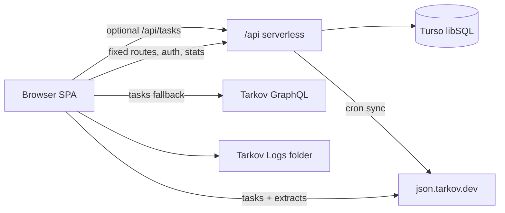

# Integration Architecture

**Date:** 2026-08-09  
**Parts:** React SPA (`web/src`) ↔ Vercel API (`web/api`) ↔ Turso ↔ External Tarkov data

## Overview

Both UI and API ship from the same Vercel project (`web/` root). The SPA calls same-origin `/api/*`. Quest content also comes from public Tarkov APIs and bundled fallbacks. Shared mutable state on the server is limited to fixed route points, visits/presence/usage, and optional task snapshots.

## Integration points

| From | To | Contract | Auth |
|------|-----|----------|------|
| SPA | `/api/auth/*` | login, session, daily-code | password / session token |
| SPA | `/api/fixed-routes` | list / CRUD | GET public; writes Admin Bearer |
| SPA | `/api/stats/visit` | impressions, visits, usage events | visitor/session ids |
| SPA | `/api/stats/presence` | online heartbeat | visitor id |
| SPA | `/api/admin/*` | ping, dashboard | Admin Bearer |
| SPA | json.tarkov.dev | tasks, extracts | none |
| SPA | GraphQL | tasks fallback | none |
| Cron/Admin | `/api/cron/sync-tasks` | fill Turso snapshots | CRON_SECRET / ADMIN |
| SPA (optional) | `/api/tasks` | read snapshots | none |

## Data ownership

| Data | Owner | Persistence |
|------|-------|-------------|
| Quest/story progress | Client | localStorage |
| Personal route pins | Client | localStorage |
| Task cache | Client | IndexedDB + bundled JSON |
| Fixed route pins | Server | Turso `fixed_route_points` |
| Visits / presence / usage | Server | Turso (+ tables outside ensureSchema) |
| Task snapshots | Server cron | Turso `task_snapshots*` |
| Storyline narrative | Repo | `web/src/data/storyline.json` |

## Deploy coupling

- `vercel.json` rewrites `/admin/*` → `index.html` for SPA admin routes
- Root Directory on Vercel must be `web` when deploying from monorepo root
- Env secrets are server-only; client never embeds `ADMIN_TOKEN` / Turso / permanent tokens

## Brownfield notes

- Usage client comment mentions `/api/stats/usage`; implementation posts to `/api/stats/visit` with `events`
- `AdminDashboardPage` / `siteTasks` are partially integrated (API ready, UI/path incomplete)
- Schema bootstrap incomplete for analytics/task tables — see [data-models-api.md](./data-models-api.md)

---

_Generated using BMAD Method `document-project` workflow_
